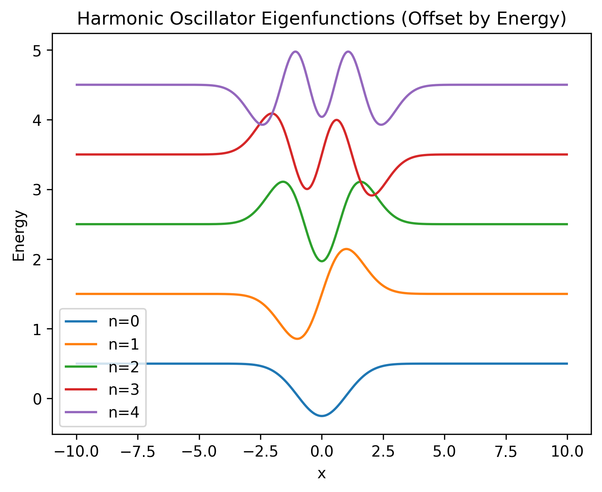
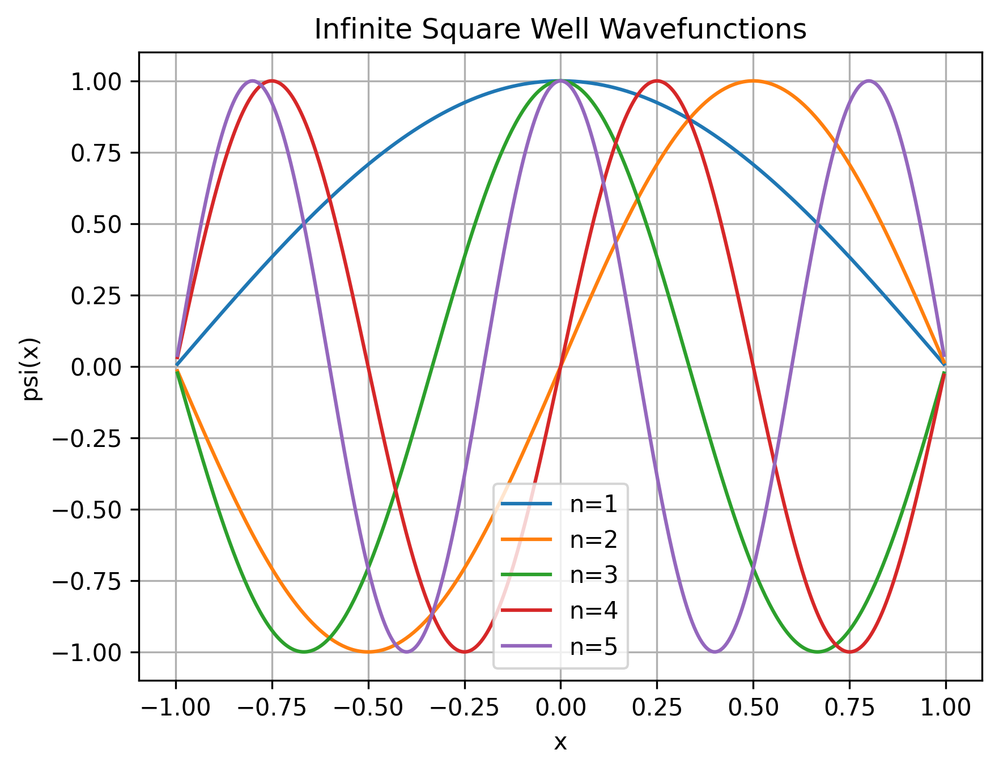
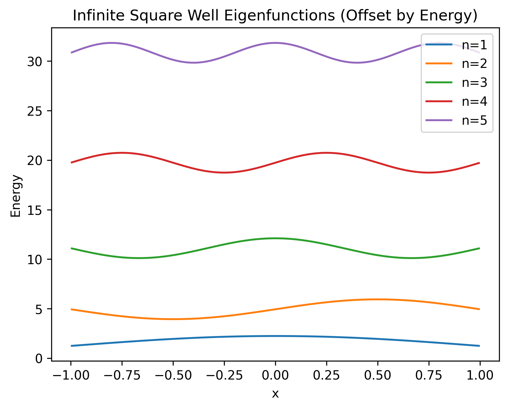
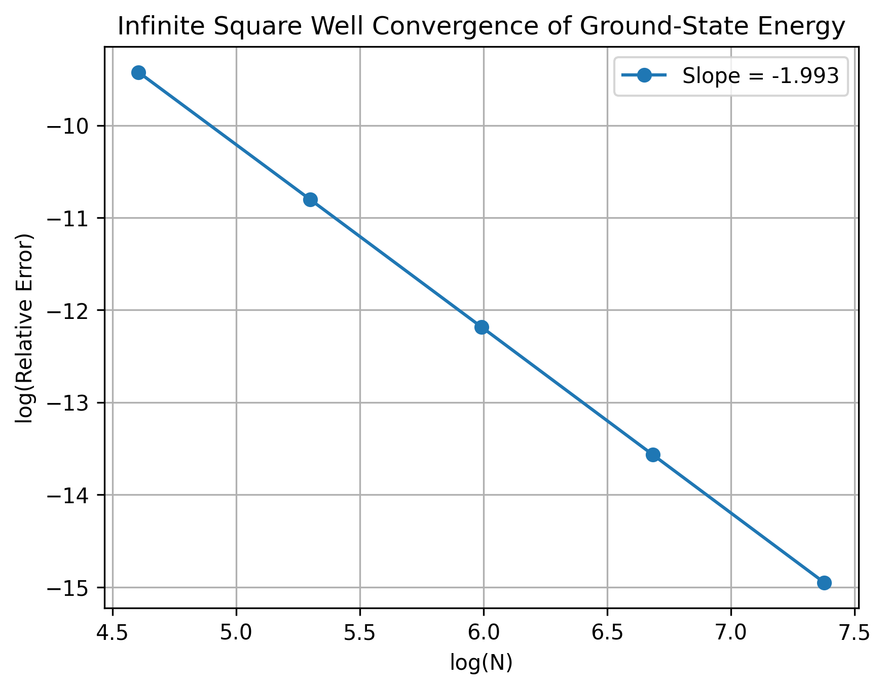
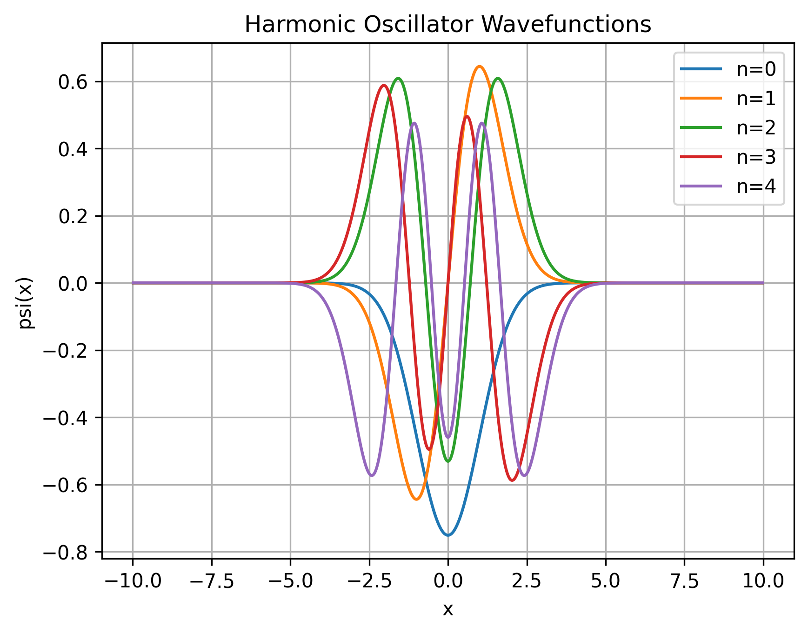
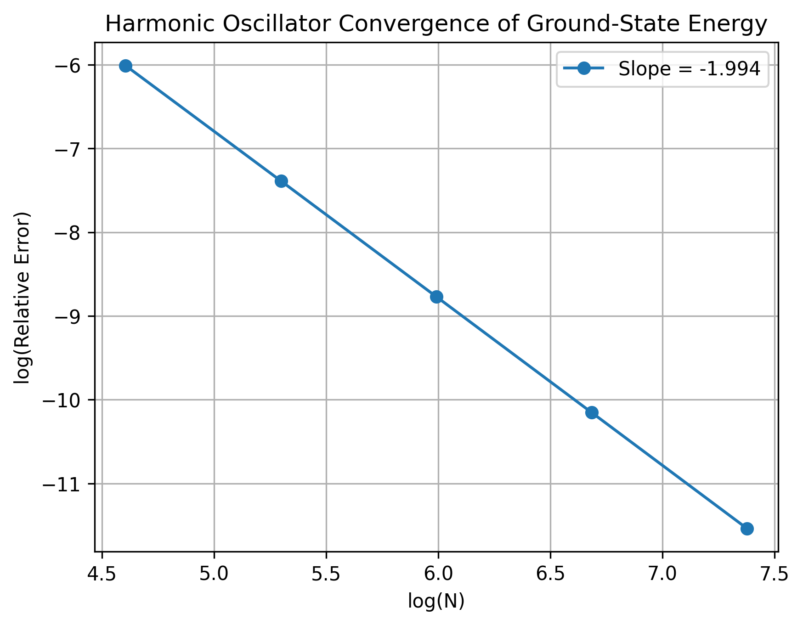

# Finite-Difference Schrödinger Solver

Finite-difference solution of the 1D time-independent Schrödinger equation with convergence analysis and benchmark quantum systems.



A Python implementation of a finite-difference solver for the one-dimensional time-independent Schrödinger equation.

This project was developed as a learning and research exercise in computational quantum mechanics and numerical methods.

The project demonstrates the application of finite-difference methods,
matrix eigenvalue problems, and convergence analysis to quantum-mechanical
boundary-value problems.


## Features

- Finite-difference discretization of the second derivative
- Construction of the Hamiltonian matrix
- Numerical solution of the eigenvalue problem
- Wavefunction normalization
- Relative error analysis
- Convergence-order verification
- Automatic generation of figures and data files

## Repository Structure

```text
├── schrodinger_solver.py
├── examples.py
├── figures/
│   ├── box_wavefunctions.png
│   ├── box_eigenfunctions.png
│   ├── box_convergence.png
│   ├── ho_wavefunctions.png
│   ├── ho_eigenfunctions.png
│   └── ho_convergence.png
├── data/
│   ├── box_energies.csv
│   └── ho_energies.csv
└── README.md
```

## Physical Problems Included

Two benchmark quantum-mechanical systems are included to validate the solver and study its numerical accuracy.

### Infinite Square Well

The solver computes the energy eigenvalues and eigenfunctions of a particle confined in a one-dimensional infinite square well.

The numerical results are compared with the analytical solution

For a box defined on the interval

$$
x \in [-1,1],
$$

the analytical energies are

$$
E_n=\frac{(n\pi)^2}{8}.
$$

### Infinite Square Well Wavefunctions



### Infinite Square Well Eigenfunctions



### Infinite Square Well Convergence



### Harmonic Oscillator

The solver computes the eigenstates of the dimensionless quantum harmonic oscillator with potential

$$
V(x) = \frac{1}{2}x^2.
$$

and compares the numerical energies with the analytical result

$$
E_n = n + \frac{1}{2}.
$$

### Harmonic Oscillator Wavefunctions



### Harmonic Oscillator Eigenfunctions


### Harmonic Oscillator Convergence



## Numerical Method

The second derivative is approximated using a central finite-difference scheme

$$
\frac{d^2\psi}{dx^2}
\approx
\frac{\psi_{i+1}-2\psi_i+\psi_{i-1}}{\Delta x^2}
$$

The resulting Hamiltonian matrix is diagonalized to obtain the discrete energy eigenvalues and corresponding eigenfunctions.

## Convergence Study

The numerical error decreases approximately as

$$
\mathrm{Error} \propto N^{-2}
$$

indicating second-order convergence of the finite-difference discretization.

## Example Results


The fitted convergence slopes confirm the expected second-order accuracy
of the finite-difference discretization.

| Problem               | Convergence Slope |
|-----------------------|------------------:|
| Infinite Square Well  |           -1.993 |
| Harmonic Oscillator   |           -1.994 |


## Requirements

- Python 3.x
- NumPy
- Matplotlib
- Pandas

Install dependencies:

```bash
pip install numpy matplotlib pandas
```


## Usage

```bash
python examples.py
```

Running the script will:

- Compute eigenvalues and eigenfunctions
- Generate plots
- Save figures in the `figures/` directory
- Save numerical data in the `data/` directory

## Author

Maryam Asghari

Project created as part of a self-directed study program in computational physics, numerical analysis, and scientific programming.

